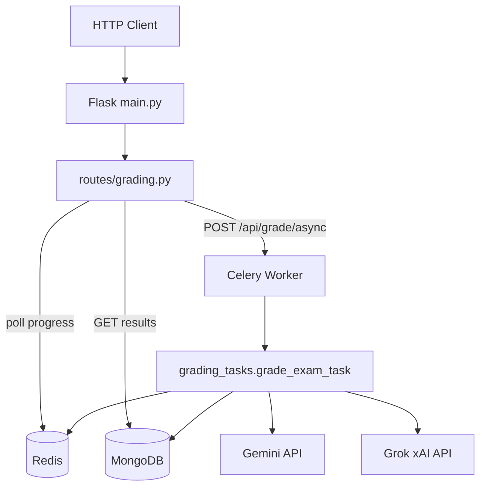

# grade-cheat — Technical Documentation

Exam grading and plagiarism detection service. Flask handles HTTP, Celery runs long grading jobs, Redis tracks progress, MongoDB stores results.

**Default URL:** `http://localhost:3004`

---

## 1. Architecture



| Component | Role |
|-----------|------|
| **Flask** | REST API, validates requests, enqueues Celery jobs |
| **Celery** | Background worker; grades all students in one task |
| **Redis** | Task progress + one-lock-per-exam |
| **MongoDB** | Persistent results, analytics, task history |
| **DataProvider** | Loads exam questions and submissions (mock data today) |

---

## 2. Directory Layout

```
grade-cheat/
├── main.py                      # Flask entry point
├── TECHNICAL.md                 # This file
├── .env                         # Secrets and config (not committed)
├── requirements.txt
└── app/
    ├── config.py                # Loads .env, all settings
    ├── celery_app.py            # Celery broker config
    ├── data_provider.py         # Exam/submission data source
    ├── grader.py                # Routes MCQ vs text grading
    ├── gemini_keys.py           # Gemini key pool + retry on quota
    ├── embeddings.py            # Gemini embeddings for plagiarism
    ├── semantic_index.py        # ChromaDB per-exam index
    ├── plagiarism.py            # TF-IDF + semantic similarity
    ├── routes/grading.py        # HTTP endpoints
    ├── tasks/grading_tasks.py   # Celery grade_exam_task
    ├── services/
    │   ├── gemini_service.py    # GeminiGradingService + GrokGradingService
    │   ├── rate_limiter.py      # call_with_limit, retry_with_backoff
    │   ├── task_tracker.py      # Task lifecycle + exam lock
    │   └── analysis_service.py  # Class analytics after grading
    ├── cache/redis_client.py    # Redis helpers
    └── models/database.py       # MongoDB repositories + to_json()
```

---

## 3. End-to-End Flow

### 3.1 Start grading (HTTP → Celery)

```
POST /api/grade/async?examId=exam_001&mode=medium
```

1. **Validate** — `examId` required; `mode` must be `strict`, `lenient`, or `medium`.
2. **Load data** — `DataProvider.get_exam_questions()` and `get_exam_submissions()`.
3. **Block duplicates:**
   - **409** if MongoDB already has results for this exam (`ExamResultRepository.exists_for_exam`).
   - **409** if Redis shows an active task for this exam (`TaskTracker` + exam lock).
4. **Create task** — UUID task id, progress `{current: 0, total: N}` stored in Redis + MongoDB.
5. **Acquire lock** — Redis key `grading:exam:{examId}` → `taskId`.
6. **Enqueue** — `grade_exam_task.delay(exam_id, mode, task_id, instructions)`.
7. **Respond 202** — `{ taskId, progressUrl }`.

### 3.2 Poll progress

```
GET /api/grade/progress?taskId=<uuid>
```

Reads Redis key `grading:{taskId}`. Status values: `pending` → `processing` → `completed` | `failed`.

### 3.3 Celery task (`grade_exam_task`)

Runs entirely inside the worker:

```
start_task(task_id)
    ↓
load questions + submissions
    ↓
prepare_plagiarism_index(exam_id, submissions)   ← TF-IDF peer map + Chroma index
    ↓
for each student submission:
    for each answer:
        grade_question()          ← MCQ or LLM
        check_plagiarism()        ← text questions only
        update_progress(task_id)
    ↓
insert_many(exam_results)         ← MongoDB exam-results
    ↓
calculate_analysis(exam_id)       ← MongoDB exam-analysis
    ↓
complete_task(task_id)            ← releases exam lock
```

On any unhandled exception → `fail_task()` (sets status `failed`, releases lock).

### 3.4 Fetch results

```
GET /api/results?examId=exam_001
GET /api/analytics?examId=exam_001
```

Results come from MongoDB collections `exam-results` and `exam-analysis`. All `ObjectId` values are converted via `to_json()` before the HTTP response.

---

## 4. Grading Logic

Entry: `grader.grade_question(question, answer, mode, grader)`

```
                    grade_question()
                           │
              ┌────────────┴────────────┐
              │                         │
         type == mcq              type == text
              │                         │
         grade_mcq()          GeminiGradingService.grade_answer()
    (exact string match)                  │
                              ┌───────────┴───────────┐
                              │                       │
                         Gemini OK              Gemini fails
                              │                  (quota/error)
                              │                       │
                              ▼                       ▼
                         return score        GrokGradingService.grade_answer()
```

### 4.1 MCQ (`grader.grade_mcq`)

Case-insensitive exact match against `referenceAnswer`. No API calls.

### 4.2 Text — Gemini (`GeminiGradingService`)

1. `run_with_retry()` rotates through `GEMINI_API_KEYS` (or single `GEMINI_API_KEY`).
2. On 429/quota → mark key exhausted, try next key; if all exhausted → wait and reset.
3. Each call uses `google-genai` `generate_content` with JSON output (same SDK as embeddings).
4. `call_with_limit()` spaces requests via rate limiter.

### 4.3 Text — Grok fallback (`GrokGradingService`)

If Gemini fails entirely:

1. HTTP POST to `GROK_BASE_URL/chat/completions` (xAI API, plain `requests`).
2. `retry_with_backoff()` on quota errors.
3. Parse JSON response into same grading shape.

---

## 5. Plagiarism Logic

Entry: `plagiarism.check_plagiarism(exam_id, student_id, question_id, answer, peer_index)`

Only runs for **text** questions inside the Celery loop.

### 5.1 Index setup (once per exam)

`prepare_plagiarism_index()`:

1. **Peer index** — groups all students' text answers by `questionId` (for TF-IDF corpus).
2. **Semantic index** — embeds all text answers via Gemini (`embeddings.py`) into ChromaDB (`semantic_index.py`).

If Chroma/Gemini unavailable → semantic step skipped; TF-IDF still works.

### 5.2 Per-answer check

```
check_plagiarism()
       │
       ├─ empty answer → score 0
       ├─ no peers     → score 0
       ├─ exact copy   → 100% (forced)
       ├─ semantic index ready → hybrid (60% semantic + 40% TF-IDF)
       └─ else         → TF-IDF only
```

**Flag threshold:** `CHEATING_THRESHOLD` (default 85%). Above → `cheatingFlag: true`.

**Hybrid formula:**

```
combined = SEMANTIC_WEIGHT × semantic + TFIDF_WEIGHT × tfidf   (default 0.6 / 0.4)
cheatingScore = combined × 100
```

---

## 6. Data Stores

### 6.1 Redis keys

| Key | Value | Purpose |
|-----|-------|---------|
| `grading:{taskId}` | JSON progress blob | Live task status (TTL 24h) |
| `grading:exam:{examId}` | `taskId` | One active grading job per exam |

### 6.2 MongoDB collections

| Collection | Contents |
|------------|----------|
| `exam-results` | Per-student scores, per-question feedback, plagiarism fields |
| `exam-analysis` | Class avg, top students, strong/weak topics |
| `grading-tasks` | Task history (mirrors Redis progress) |

### 6.3 Result document shape (per student)

```json
{
  "examId": "exam_001",
  "studentId": "student_001",
  "totalScore": 12,
  "totalMarks": 15,
  "percentage": 80.0,
  "gradingMode": "medium",
  "gradedAt": "2026-05-30T...",
  "results": [
    {
      "questionId": "q1",
      "score": 4,
      "maxMarks": 5,
      "isCorrect": true,
      "feedback": "...",
      "reasoning": "...",
      "cheatingScore": 12.5,
      "cheatingFlag": false,
      "cheatingDetails": { ... }
    }
  ]
}
```

---

## 7. API Reference

| Method | Path | Description |
|--------|------|-------------|
| GET | `/` | Service info + endpoint list |
| GET | `/api/health` | Health check |
| POST | `/api/grade/async?examId=&mode=&instructions=` | Start async grading |
| GET | `/api/grade/progress?taskId=` | Poll task status |
| DELETE | `/api/grade/cleanup?taskId=` | Delete task + release lock |
| GET | `/api/results?examId=` | Graded results |
| GET | `/api/analytics?examId=` | Class analytics |
| GET | `/api/tasks?examId=` | Task history for exam |

**HTTP status codes:**

- `202` — grading started
- `409` — exam already graded or task already running
- `404` — no data / task not found

---

## 8. Configuration

Loaded from `grade-cheat/.env` via `app/config.py`.

| Variable | Default | Purpose |
|----------|---------|---------|
| `FLASK_PORT` | `3004` | HTTP port |
| `GEMINI_API_KEY` | — | Single Gemini key |
| `GEMINI_API_KEYS` | — | Comma-separated keys (rotation) |
| `GEMINI_MODEL` | `gemini-2.5-flash` | Text grading model |
| `GEMINI_EMBEDDING_MODEL` | `gemini-embedding-001` | Plagiarism embeddings |
| `GEMINI_RATE_LIMIT_RPM` | `5` | Max LLM calls per minute |
| `GEMINI_RETRY_WAIT_SECONDS` | `60` | Backoff on quota |
| `GEMINI_MAX_RETRIES` | `10` | Max retry attempts |
| `GROK_API_KEY` | — | Fallback grader |
| `GROK_MODEL` | `grok-4-1-fast-reasoning` | Grok model |
| `GROK_BASE_URL` | `https://api.x.ai/v1` | xAI API base |
| `GROK_TIMEOUT` | `360` | Request timeout (seconds) |
| `MONGODB_URI` | `mongodb://localhost:27017` | MongoDB |
| `MONGODB_DB` | `exam_grading` | Database name |
| `REDIS_URL` | — | Redis + Celery broker |
| `CHEATING_THRESHOLD` | `85` | Plagiarism flag % |
| `SEMANTIC_WEIGHT` | `0.6` | Hybrid semantic weight |
| `TFIDF_WEIGHT` | `0.4` | Hybrid TF-IDF weight |
| `CHROMA_MODE` | `ephemeral` | `ephemeral` or `persistent` |
| `USE_MOCK_DATA` | `true` | Use built-in `exam_001` mock data |

---

## 9. Running the Service

**Prerequisites:** Python venv, Redis, MongoDB, API keys in `.env`.

```bash
cd server/src/modules/grade-cheat
pip install -r requirements.txt

# Terminal 1 — API
python main.py

# Terminal 2 — worker
celery -A app.celery_app worker --loglevel=info
```

**Quick test (mock exam):**

```bash
# Start grading
curl -X POST "http://localhost:3004/api/grade/async?examId=exam_001&mode=medium"

# Poll (use taskId from response)
curl "http://localhost:3004/api/grade/progress?taskId=<uuid>"

# Results
curl "http://localhost:3004/api/results?examId=exam_001"
```

**Plagiarism unit tests:**

```bash
python tests/test_plagiarism.py
```

---

## 10. Mock Data

When `USE_MOCK_DATA=true`, fixtures live in `app/data/exams.json` with the **original mock schema**:

**Question:** `examId`, `questionId`, `type` (`text`|`mcq`), `topic`, `questionText`, `marks`, `referenceAnswer`, and `options` (MCQ only).

**Submission:** `examId`, `studentId`, `answers[]` where each answer has `questionId`, `submittedAnswer`, `questionType`, `marksAllocated`.

**exam_001:** 5 questions (4 text, 1 MCQ), 3 students (`student_001`–`student_003`).

Replace `DataProvider` with real API calls when integrating with the main ISL platform.

---

## 11. Error Handling

| Scenario | Behavior |
|----------|----------|
| Gemini quota on one answer | Rotate keys → wait → retry; then Grok |
| Both LLMs fail on one answer | That question gets `error` field; task continues |
| Fatal task error | Task `failed`, exam lock released, no partial MongoDB save |
| Duplicate grade request | HTTP 409 before Celery starts |
| Missing exam data | HTTP 404 (API) or task fail (worker) |

---

## 12. Key Design Decisions

- **One Celery task per exam** — grading + plagiarism in a single pass; no separate sync path.
- **One active task per examId** — Redis lock prevents concurrent runs.
- **No re-grade by default** — MongoDB check blocks second grading of same exam.
- **Grok via HTTP** — no OpenAI SDK; only `requests` for xAI compatibility.
- **Gemini via google-genai** — no LangChain; same SDK as plagiarism embeddings.
- **Rate limiting centralized** — all LLM calls use `rate_limiter.call_with_limit()`.
